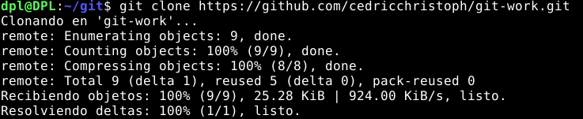

# Informe tarea de git
## Cedric y Jesus

---
### Introducción

La tarea a realizar constaba de una serie de pasos para comprobar y aprender los diferentes codigo que nos proporciona git para trabajar proyectos de forma grupal, y la potencia y funcionalidad de git Git ya que podemos observar que se ha ideado para posibilitar la ramificación y el etiquetado como procesos de primera importancia y las operaciones que afectan a las ramas y las etiquetas como control de versiones que es finalmente la utilidad principal de git.
Los puntos a realizar son:
1. El alumnado trabajará por parejas: alu1 y alu2
2. alu1 creará un repositorio público git-work en su cuenta de GitHub, añadiendo un README.md y una licencia MIT.
3. alu1 clonará el repo y añadirá los ficheros: index.html, bootstrap.min.css y cover.css. Luego subirá los cambios al upstream.
4. alu2 creará un fork de git-work desde su cuenta de GitHub.
5. alu2 clonará su fork del repo.
6. alu2 creará una nueva rama custom-text y modificará el fichero index.html personalizándolo para una supuesta startup.
7. alu2 enviará un PR a alu1.
8. alu1 probará el PR de alu2 en su máquina, y propondrá ciertos cambios que deberá subir al propio PR.
9. alu1 y alu2 tendrán una pequeña conversación en la página del PR, incluso pudiendo añadir más cambios si fuera necesario.
10. alu1 finalmente aprobará el PR y lo incluirá en la rama principal.
11. alu2 deberá incorporar los cambios incluidos en la rama principal.
12. alu1 cambiará la línea 10 de cover.css a: color: purple;
14. alu1 hará simplemente un commit local en main.
15. alu2 creará una nueva rama cool-colors y cambiará la línea 10 de cover.css a: color: darkgreen;
17. alu2 enviará un PR a alu1.
18. alu1 probará el PR de alu2 y tendrá que gestionar el posible conflicto al mergear en la rama principal.
19. alu1 etiquetará esta versión como 0.1.0 y creará una "release" en GitHub apuntando a esta etiqueta.

La tarea fue planteada para dos alumnos, las tareas del alumno 1 fueron realizadas por Jesus y las tareas del alumno 2 por Cedric.

---
### Desarrollo

Empezamos creando el repositorio publico en git hub, para ello nos dirigimos a nuestra pagina de git, nos metemos en nuestro repositorios y pulsamos crear uno nuevo, en este caso le añadiremos un README.md y una Licencia de MIT

Lo siguiente sera clonar el repositorio y añadir los ficheros solicitados.

Existen tres formas de clonar un repositorio para ello  nos dirigimos a GitHub en la página principal del repositorio. Encima de la lista de archivos, hacemos  clic en code:

- Para clonar el repositorio con HTTPS, en «HTTPS» haz clic en el icono de portapapeles.
- Para clonar el repositorio mediante una clave SSH, incluido un certificado emitido por la entidad de certificación SSH de la organización, haga clic en Usar SSH y luego en el icono de portapapeles.
- Para clonar un repositorio mediante GitHub CLI, haz clic en GitHub CLI y, después, haz clic en .

En nuestro caso lo ralizamos mediante HTTPS con el comando git clone

Subimos los cambios con:
- git add .
- git commit -m "primer commit"
- git push
- Además con git status podemos ver si se ha realizado correctamente.

En el siguiente apartado el alu2 debe realizar un fork desde su propia cuenta. Esto no es nada mas que realizar una bifurcación, una copia del repositorio de alu1. Bifurcar un repositorio te permite experimentar libremente con cambios sin afectar el proyecto original.

Una vez realizado el fork, alu2 clonara su fork del repo:

Una vez clonado alu2 se encargo de crear una nueva rama custom-text y modificará el fichero index.html personalizándolo para una supuesta startup, esta startup la llamamos Coffee to go!.

Una vez creada esta nueva rama alu2 envio un PR a alu1. Esto es una solicitud de incorporar cambios permite comentar a otros, en este caso a alu1, acerca de los cambios que has insertado en una rama de un repositorio en GitHub. Una vez que se abre una solicitud de incorporación de cambios, puedes debatir y revisar los posibles cambios con los colaboradores y agregar confirmaciones de seguimiento antes de que los cambios se fusionen en la rama base, esto es lo que realizaremos en los siguientes pasos.

Ahora alu1 deberá probar este PR y propondrá una serie de cambios.

Con el comando git remote nos permite crear, ver y eliminar conexiones con otros repositorios, en este caso alu1 esta estableciendo una conexión con la rama del PR de alu2.

Con git checkout permite desplazarnos entre las ramas creadas por git branch.

Con git push subimos los cambios que he realizado al PR de alu2

Tras los cambios iniciales de alu1 y las conversaciones entre los dos alu, alu2 se encargo de realizar los ultimos cambios, primero hace un pull de los cambios realizados por alu1 luego lo sube a su main y hace un merge de los cambios.

Con git Switch cambiamos entre ramas de nuestro repositorio para subir los cambios en la rama correcta.

La conversacion entera se puede ver en :

[Conversación PR](https://github.com/JesusSosaMorales/git-work/pull/1)

Y finalmente el Merge de alu1

Ahora alu1 cambiara la linea 10 en el cover.css y hara un commit en local

Despues alu2 creara una nueva rama y y cambiara el cover.css

Se crea igual que hemo hecho con anterioridad.

Ahora para visualizar este posible conflicto ya que tenemos cambios que chocan entre los dos, alu 1 analizara y decidira la solución, vemos que el conflicto aparece en cover.css.

Aqui alu1 se va a encargar de resolver el problema en este caso es muy facil de solucionar ya que es solo una linea de código con lo que basta con quedarte con una de las dos opciones, a continuación vemos que se han corregido los problemas.

Hacemos git merge.

Ahora alu1 etiqueta esta versión como v0.1.0 y hara un release

Creamos la etiqueta de la version con:

Y la subimos al main con:

Ahora para hacer el release vamos al repositorio en github y pulsamos en tags y en crear un nuevo release, tal y como se ve en la imagen:

Puedes ver el release [aquí](https://github.com/JesusSosaMorales/git-work/releases/tag/v0.1.0)

Además puedes ver el PR de esta segunda rama [aquí](https://github.com/JesusSosaMorales/git-work/pull/2)

